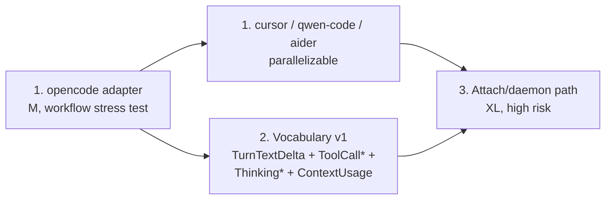

# Roadmap v1 — High-Leverage Investments

Plan for three work items identified as the highest-leverage investments
in the harness-wrapper project. Each unlocks real consumers; each has a
concrete smallest-valuable-version.

Status: design decisions resolved (see "Decisions made" below).
Implementation plans for individual items are produced on request, one
at a time.

> A fourth item — a persistent `chat.Store` implementation (SQLite) —
> was on an earlier draft and has been dropped. Trace through known
> consumers and none are blocked on durable Store metadata: loomcli has
> its own FleetDB, harness-chatd is process-bounded (live PTY dies with
> the process, so persisted metadata is academic), CLI users don't
> touch `pkg/chat`, and the future daemon owns wrapper sessions rather
> than chat sessions. Revisit only when a concrete consumer asks.

---

## Decisions made

| Area | Decision |
|---|---|
| Daemon transport (item 3) | **Byte-proxy only**. Daemon owns the PTY master fd; clients connect via Unix socket and read/write bytes through the proxy. No `SCM_RIGHTS`. |
| Daemon lifecycle (item 3) | **Auto-spawn with manual override**. Client connects; on `ENOENT`/`ECONNREFUSED`, fork-exec a fresh daemon and retry. Daemon exits after configurable idle timeout (default 30 min of zero active runs). Manual mode (`harness-wrapperd --foreground`) remains available for ops who want systemd/launchd ownership. |
| Daemon vs. tmux mode (item 3) | **Coexist**. tmux mode stays as the simple shell-user path; daemon mode is for programmatic-spawn + later-human-attach. Document the decision matrix in `docs/attach-vs-tmux.md`. |
| First new adapter (item 1) | **opencode**. |
| Community adapters (item 1) | **Accepted, with PR-template requirements** (corpus scenarios + adversarial recordings + `versions.json` pin + CI drift check + maintainer sign-off). |
| Event-kind shape (item 2) | **Separate `Kind` values, additive**. New kinds added alongside existing; consumers feature-detect by `Event.Kind`. Old consumers ignore new kinds. |
| Vocabulary additions (item 2) | **`ThinkingStarted` / `ThinkingCompleted`** + **`ContextUsage`** in scope. **`TurnTextDelta`** and structured **`ToolCall*`** carry over from the original proposal. **`CostDelta` deferred** (rationale below). |
| Sequencing | adapters first → vocabulary in parallel with remaining adapters → daemon last. |

---

## 1. More harness adapters

**Goal.** Expand coverage so `harness-wrapper` is the default supervisor
for any meaningful CLI agent — not just the three currently supported.

### Workflow per adapter

1. Identify the harness's turn-complete signal (prompt-region marker,
   footer line, etc.).
2. Identify session-ID surfacing (TUI banner? `--resume` flag emission?).
3. Identify cost/quota/retry/error patterns.
4. Identify transcript JSONL location and schema (if the harness keeps
   one).
5. Implement:
   - `pkg/turns/harness/<name>/adapter.go` with screen/status observers
   - `pkg/wrapper/internal/harness/<name>/classifier.go` for cost/quota
     patterns
   - `pkg/transcript/<name>/reader.go` (if applicable)
6. Record corpus scenarios under `test/corpus/<name>/`:
   - canonical: idle, blocked-by-cost, errored, multi-turn-with-tools
   - adversarial: assistant echoing the marker shape (must NOT fire)
7. Wire into `pkg/chat.resolveAdapter` and `cmd/harness-chatd`.
8. Add `versions.json` entry for the upstream drift sentry.

### Adapter ordering

1. **opencode** (first — stress-tests the onboarding workflow).
2. **cursor**, **qwen-code**, **aider** — parallelizable once opencode is
   landed and the workflow rough edges are smoothed.
3. Others (sweepy, plandex, etc.) as community PRs come in.

### Community-contributed adapters

Accepted, with a `CONTRIBUTING-adapter.md` that codifies:
- The 8-step workflow above
- Corpus-recording protocol (using the existing `screenbench-record` /
  `make rebake-corpus` tooling)
- Required scenarios (≥1 canonical + ≥1 adversarial per detected state)
- Required `versions.json` entry with an initial pin
- A maintainer sign-off step before merge
- CI enforcement that drift sentry passes against the new adapter pin

### Risk and effort

- **Risk**: Low per adapter; aggregate maintenance burden grows linearly
  (each TUI is a moving target — the drift sentry mitigates this).
- **Effort**: M for opencode (discovery + workflow grooming), S each for
  subsequent adapters if the TUI is well-behaved.

---

## 2. Richer turn vocabulary

**Goal.** Surface more of what the harness is actually doing — partial
text as it streams, structured tool-call payloads, reasoning indicators,
context-window usage — so consumers can build better UIs and
finer-grained automation.

### New event kinds (v1 scope)

#### 2a. `TurnTextDelta`

Emitted as the harness renders new text on the prompt-region. Adapters
identify "new text" by diffing the prompt-region snapshot against the
previous one.

**Honest framing**: this is a **best-effort approximation** of streaming
from TUI-rendered bytes, not true token-level streaming. Some harnesses
re-render the same line multiple times; the adapter has to dedupe and
may still get it wrong. Consumers that need token-level fidelity should
read the harness's own JSONL via `pkg/transcript`.

#### 2b. `ToolCallStarted` / `ToolCallCompleted` / `ToolCallFailed`

Replaces the single `ToolCall` event with three lifecycle stages. Each
carries an optional `ToolCallDetail` payload:

- `Name` (best-effort, parsed from TUI)
- `Args` (raw string, harness-specific format)
- `Status` (implicit in the Kind)

Some harnesses don't expose tool args in the TUI; in that case the field
stays empty.

#### 2c. `ThinkingStarted` / `ThinkingCompleted`

For reasoning models that surface chain-of-thought (Claude extended
thinking, OpenAI o1 routed via Codex). Distinct from regular text
deltas so consumers can render thinking content in a collapsible UI.

#### 2d. `ContextUsage`

Emitted when the adapter scrapes a context-window usage indicator from
the TUI footer. Carries:

- `Used` (tokens, if surfaced)
- `Total` (window size, if surfaced)
- `Fraction` (0.0–1.0, computed or scraped)

Visible in claude-code's footer and codex's stats line. Adapter has to
know where to look per-harness.

### Explicitly deferred

- **`CostDelta`** (per-turn $ cost + token counts). Cost telemetry is
  legitimately useful but: (a) the TUI display format varies wildly
  across harnesses, (b) some harnesses don't surface it at all, (c)
  consumers that need precise cost accounting should read the harness's
  own JSONL via `pkg/transcript` rather than scraping TUI footers.
  Revisit if a concrete consumer asks for it.
- **Permission/approval prompts** as a distinct kind — too
  harness-specific to model uniformly. Covered today by
  `waiting_for_input` at the wrapper layer.
- **File-edit-specific events** — already covered by `ToolCall*`.

### Compatibility and rollout

- **Additive change**: `pkg/turns.Event.Kind` gains new constants. Old
  consumers `switch ev.Kind { … default: }` ignore them. No breaking
  change.
- **Adapter consistency**: not every adapter implements every kind.
  Document per-adapter capability in `docs/adapter-capabilities.md`.
  Consumers feature-detect by `Kind`.
- **Corpus coverage**: every new Kind needs at least one positive +
  one adversarial scenario per adapter that emits it.
- **Versioning**: add `pkg/turns.VocabularyVersion` constant so
  consumers can guard logic against known kind sets.

### Risk and effort

- **Risk**: Medium. The work is bounded but inconsistent fidelity
  across adapters is a real failure mode if not managed via per-adapter
  capability docs.
- **Effort**: L. Vocabulary design + one-adapter implementation is ~1-2
  weeks; rolling out the rest scales linearly with adapter count.

---

## 3. Attach/daemon path (`pkg/wrapper/attach`)

**Goal.** Let a wrapper run started headlessly by some consumer's process
be driven later by a separate client — see live output, send input,
request stop, query state — without needing the spawning process to stay
alive.

### Architecture

A single new binary `harness-wrapperd` plus a `pkg/wrapper/attach`
client library. Daemon owns the PTY master fds; clients connect via
Unix-domain socket and read/write bytes through a proxy.

```
                     ┌─────────────────────────────┐
                     │ harness-wrapperd            │
   client ─socket──▶ │   ├─ run registry           │ ─PTY─▶ harness
   client ─socket──▶ │   ├─ proxy I/O loops        │ ─PTY─▶ harness
                     │   └─ trace + classifier     │
                     └─────────────────────────────┘
```

### v1 surface

- **Daemon process**: long-lived, owns `*wrapper.Session` registry keyed
  by run-ID.
- **Socket**: `$XDG_RUNTIME_DIR/harness-wrapper.sock` (falls back to
  `~/.harness-wrapper/run/socket` if `XDG_RUNTIME_DIR` is unset).
- **Wire protocol**: length-prefixed JSON frames with `protocol_version`
  in handshake. Mismatched versions reject early with an explicit error.
- **RPCs**:
  - `Start(Config) → {run_id}`
  - `Attach(run_id) → bidirectional stream {input_keys, output_bytes, status_events, resize}`
  - `Snapshot(run_id) → {Snapshot, Status}`
  - `Stop(run_id, reason) → Result`
  - `List() → [{run_id, harness, status, started_at}]`
- **Auto-spawn**: client library detects socket-missing and forks
  `harness-wrapperd` before retrying once.
- **Idle exit**: daemon shuts down after `--idle-timeout` (default 30
  min) with zero active runs.
- **Client library**: `pkg/wrapper/attach.Dial(socket) (*Client, error)`
  returning typed RPC methods.
- **CLI integration**: a new `harness-wrapper daemon-attach <run-id>`
  subcommand uses the client lib. (Today's `attach` keeps targeting
  tmux; we don't reuse the name.)
- **Auth**: Unix socket file permissions only. No token layer in v1.

### Why byte-proxy

| Property | byte-proxy (chosen) | fd-passing (rejected) |
|---|---|---|
| Cross-platform | Yes | Unix-only |
| Future remote daemon | Possible | Impossible |
| Recording / replay / audit | Natural — single I/O point | Awkward — proxy fd dance |
| Multi-client output | Trivial broadcast | Complicated shared-fd writes |
| Latency | localhost socket: microseconds | Direct fd: tens of nanoseconds |
| Client complexity | Lower | Higher (`SCM_RIGHTS` parsing) |

The latency delta is invisible to humans typing in a TUI. Every other
dimension favors byte-proxy.

### Concurrency edge cases to design explicitly

- Client disconnects mid-stream (run keeps going; output buffered with
  bounded ring; next attach resumes from current snapshot, not history).
- Daemon crashes (active runs are lost; consumers must observe via
  trace files or live-reconnect to restart).
- Run completes while no client is attached (Result is held in the
  registry until a `Stop`/`Wait`/`List` consumes it, or until daemon
  idle-timeout).
- Concurrent attach to same run (allowed; output broadcasts; input is
  serialized with last-write-wins, surfaced as a `multi_writer` advisory
  event so UIs can warn).

### Risk and effort

- **Risk**: High. Largest design surface of the three.
- **Effort**: XL. 2-4 weeks of focused work for design + implementation
  + tests.

---

## Sequencing



### Rationale

1. **opencode adapter first** — proves the adapter onboarding workflow
   end-to-end. Likely surfaces drift-sentry or corpus-tooling gaps that
   we want fixed before community PRs start landing. Modest scope,
   bounded risk, immediate visible value.
2. **Remaining adapters + vocabulary in parallel** — independent
   workstreams. Doing them together means new adapters target the new
   vocabulary from day one rather than getting retrofitted later.
   Vocabulary work touches every adapter, so we want adapters
   well-understood before designing the events they should emit.
3. **Daemon last** — highest value, highest risk. Sequencing it after
   the others provides:
   - Feedback loops from real consumers (via adapter work)
   - Time for the resolved design questions to age and reveal any
     unstated assumptions before code commits to them

If priorities shift toward unblocking the daemon use case sooner, item
3 can be promoted — the open design surface is now small enough that
the risk is implementation effort, not architectural rework.

---

## Open items

Nothing blocking. Each work item's implementation plan (concrete file
list, test plan, milestones) is produced on demand when that item is
ready to start. Currently the next step is **item 1**: the opencode
adapter.
